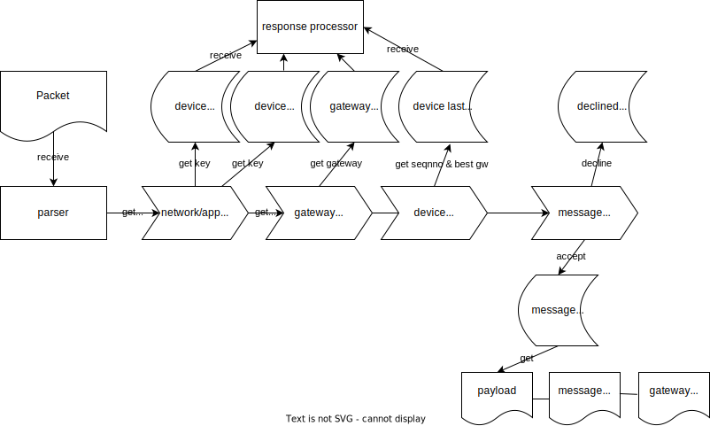

# tlns

Tiny LoRaWAN Network Server

The goal of the project is to make a network server running on the ESP32 board.

The working release of [https://github.com/commandus/lorawan-network-server](https://github.com/commandus/lorawan-network-server) runs on Raspberry. This requires much more resources.

Network server can serve 1, 2 or more gateways.

If there are 2 or more gateways, message can receive twice or more. 

Network server collects metadata sent by gateways to choose gateway with the best signal/noise ratio to send response. 

## Prerequisites

- Visual Code
- CMake
- For ESP32 install Visual Code "Espressif IDF" plugin and configure ESP-IDF 
- gettext (optional)
- Draw.io Integration Visual Code plugin (optional)

## Build

### CMake

Options:

- -DENABLE_GW_DEV_USB=off   build RAK2287 USB gateway backend
- -DENABLE_LIBUV=off   		enable libuv UDP/TCP. Default UDP only
- -DENABLE_DEBUG=off   		enable debugging output
- -DENABLE_GEN=on   		enable key generator (default in memory storage)
- -DENABLE_SQLITE=off  		enable sqlite3 backend
- -DENABLE_JSON=off   	    enable JSON file backend
- -DENABLE_MQTT=off			build with MQTT bridge
- -DENABLE_IPV6=off   		enable IPv6 (reserved)

For example, build USB gateway:
```
mkdir -p build
cd build
cmake -DENABLE_GW_DEV_USB=on -DENABLE_JSON=on ..
make
```
Install

```
sudo apt install cmake gettext
```

## Library

Library operates with two high-level class of objects:

- Messages stored in the message queue
- Tasks

Task is a glue to make asynchronous requests.
Task associated with the message in the message queue.
Task contains process stage and last operation result and intermediate data such as keys to decipher payload.

Two object classes

- Dispatcher
- Services

operates with tasks. For instance, the "Receiver" service create a new task and move it to the MessageTaskDispatcher.

Then Dispatcher putUplink task to the "Get device identity" service. 
"Get device identity" service after receiving keys return keys back tro the Dispatcher.

Dispatcher getUplink one task from the queue and move it to the appropriate service. 

Service must putUplink task in internal queue. When task is complete, service move task to the dispatcher queue.

### Message queue

Message queue is map accessed by the device address.

Each element is a vector or map accessed by message sequence number.

Each element consist of

- message sequence number (if container is a vector)
- receiving time of the first received packet (no matter which gateway is first)
- radio packet itself
- radio metadata sent by each gateway. Metadata describes receiving conditions such as signal power, signal/noise ratio etc. Metadata stored in the map of gateway identifier.

If packet received by two or more gateways, identical messages merged into the one. Metadata specific to the gateway added to the array of metadata.
Radio metadata array have at least 1 element.

Each element of the message queue has an associated task descriptor.

There is 4 operations on the queue:

- add a new message to the queue
- iterate messages in the queue - getUplink message from the queue one by one
- update message in the queue, message accessed by the address and the sequence number. It updates task descriptor stage
- remove cancelled or completed tasks from the queue

Receiver object adds a new messages to the queue, receive network and app keys over program interfaces and update received keys in the task descriptor.

If receiver successfully receives key for address, it accesses message in the queue by the address and set key in the task descriptor. 
Then it increment task stage to the "got key"

Sender object iterates messages in the queue with "got key" and initiate decipher packet. Decipher can be run in the 
main thread or runt in another thread, when it's done, the Receiver must be received result.

Sender looks what stage is and initiates tasks to obtain keys by initiate sending requests.

Sender initiate send response to the gateway. When response is successfully sent or sent with errors task descriptor 
must indicate response success or failure. 

MAC processor can create a message to be sent to the end-device over best gateway.

### Task descriptor

Task has stages:

- just received
- got device identifier: network/app keys
- deciphered
- MAC command process initiated
- accepted or declined (sent to app server or to error log)

After message is in the last stage, message waits to expire and after expiration time is deleted from the queue.

Task descriptor consists of

- stage
- device identifier: network key/app key
- stage process error code

At any stage task can be cancelled on stage process error such as
- no network or app key available (device is not registered)
- CRC error after decipher
- queue is full (no memory to process new message)

### Dispatcher

Dispatcher serves message queue. 
Each time Dispatcher has been called it getUplink one or more task descriptor ready to serve.

Then Dispatcher start one or more tasks:

- send keys requests
- decipher message
- collect radio statistics and select best gateway for each end-device
- send reply to the best gateway  
- send MAC commands to the end-device
- send messages initiated by the app server

### Receiver

Receiver object read

- packets from gateways and try to parse received packet
- network and app keys from the socket or file and then update message stage in the queue.
- end-device recommendation what gateway it the best for end-device, last received sequence number
- receives message to be sent to the end-device from the app server

Receiver wait until socket or file descriptor indicates data arrived using select() call.

Implementation of Receiver class must override receive() method.

Receiver has interfaces to access external storages:

- getUplink network key(address)
- getUplink app key(address)
- getUplink gateway(gateway id)
- putUplink MAC command
- putUplink declined message
- putUplink accepted message



Fig. 1 Receiver diagram

Receiver.receive(Packet -> message queue) return accepted or declined

### Message queue

Message queue is a main structure.

Message queue object provide

- putUplink accepted message (used by Receiver)
- list of messages need to reply to the gateway
- list of messages ready to send to the app server
- list of messages 

### Main event loop procedure

```
loop
  wait for event or timeout
  if timeout
  then run dispatcher
  else Receiver.receive
end loop
```

## USB gateway

For RAK2287 USB gateway
gw-dev-usb based on Semtech's gateway source lora_pkt_fwd.c
Copyright (C)2019 Semtech License: Revised BSD License (see LICENSE.Semtech.txt file include in the project in the gw-deb/usb folder)

gw-dev-usb require access to identities via plugin shared library.

For instance,

```shell
./gw-dev-usb -vvvvvvv -c ru -p /home/andrei/src/lorawan-storage/build/libstorage-json.so:json:json -i /home/andrei/src/lorawan-network-server/identity.json /dev/ttyACM1
```

option -p set /home/andrei/src/lorawan-storage/build/libstorage-json.so shared library, and json:json is part of 
name of the function creates access object.

## Tools

- gateway-config2cpp
- 

### gateway-config2cpp

gateway-config2cpp utility read gateway regional settings for specific region in JSON format
and generate C++ gateway-usb-conf.h header file.

gateway-usb-conf.h header file then used in the gw-dev/usb/gw-dev-usb gateway to set up frequencies etc.

You can obtain JSON files from Semtech's gateway GitHub repository.

Each Semtech's gateway JSON file contains settings for specific region.

Usage:

```
./gateway-config2cpp /home/andrei/git/rak_common_for_gateway/lora/rak2287/global_conf_usb/ *.json > gateway-usb-conf.h
```

### regional-parameters2cpp

regional-parameters2cpp read regional settings from the JSON file and
generate C++ gen/regional-parameters-3.h header file.

Then gen/regional-parameters-3.h is included in tlns source files.

Usage:
```
./regional-parameters2cpp gen/regional-parameters.json > gen/regional-parameters-3.h
```

## MSVC

Create solution by CMake:
```
mkdir C:\git\tlns\cmake-build-debug-visual-studio
cd C:\git\tlns\cmake-build-debug-visual-studio
cmake .. -DCMAKE_TOOLCHAIN_FILE=C:\git\vcpkg\scripts\buildsystems\vcpkg.cmake -DVCPKG_TARGET_TRIPLET=x64-windows
```